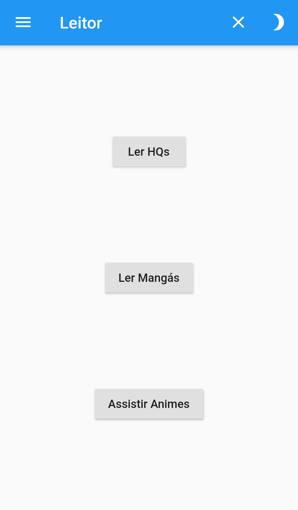
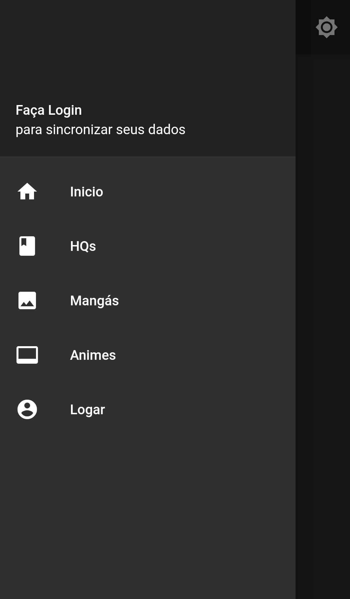
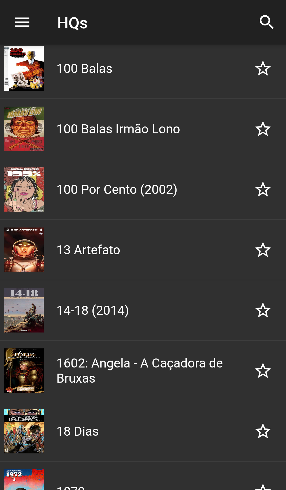
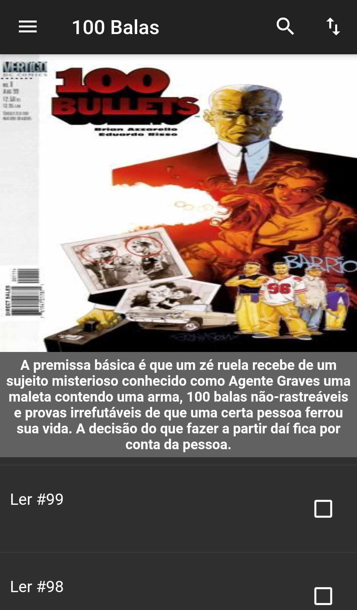
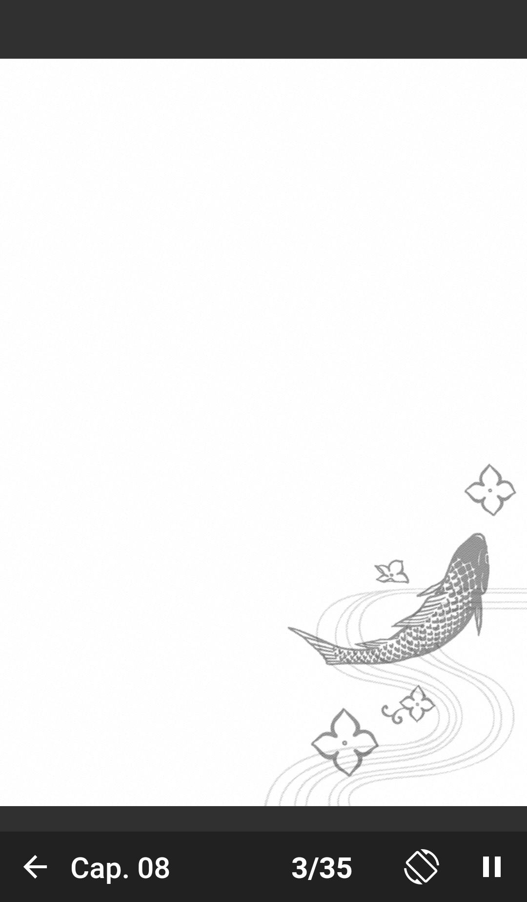
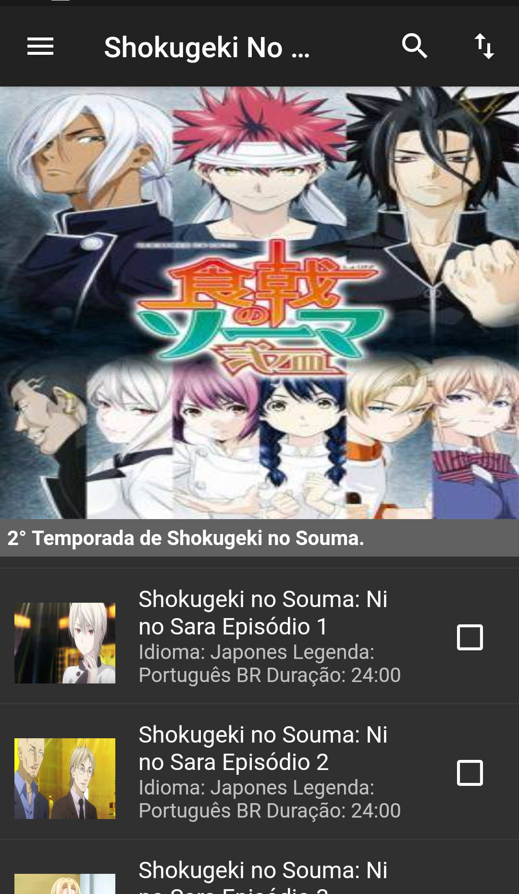

# Flutter Leitor

Aplicativo para Leitura de HQs, Mangás e Assistir Animes

Login no Aplicativo agora Disponivel com Sincronização dos dados Locais e Online

## HQs
Varias HQs Disponiveis

Lista de Capitulos Disponiveis para Leitura

## Mangás

Varios Mangás Disponiveis Podendo agora Favoritar os Titulos

Lista de Capitulos Disponiveis para Leitura agora Historico de Leitura é salvo automaticamente

Leitura no Aplicativo

## Animes

Varios Animes Disponiveis

Lista de Episodios Disponiveis para assistir

Player do Aplicativo

### Funcionalidades Adicionais

Pesquisa por Titulos

Mudar de Pagina ná Leitura a qualquer momento

## Getting Started

This project is a starting point for a Flutter application.

A few resources to get you started if this is your first Flutter project:

- [Lab: Write your first Flutter app](https://flutter.dev/docs/get-started/codelab)
- [Cookbook: Useful Flutter samples](https://flutter.dev/docs/cookbook)

For help getting started with Flutter, view our
[online documentation](https://flutter.dev/docs), which offers tutorials,
samples, guidance on mobile development, and a full API reference.
